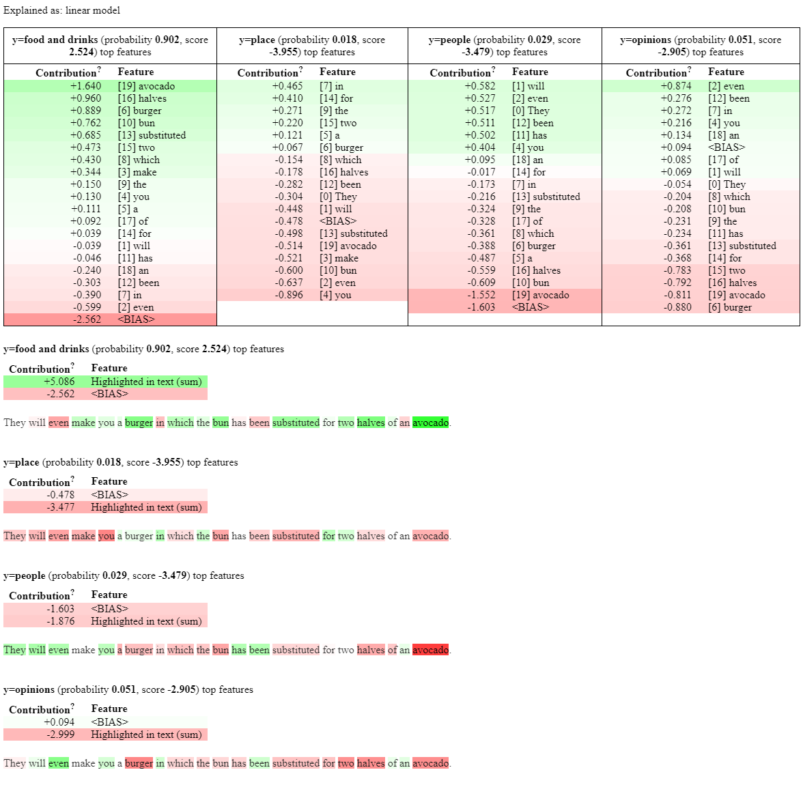

# explanations



Generating LIME heatmaps on TACA's classifier and restaurant reviews dataset.

## How to generate heatmaps

1) Install libraries in a new conda environment. On Mac:

```
conda env create -f expenv_mac.yml
```

On Windows:

```
conda env create -f expenv_win.yml
```

2) Activate conda environment:

```
conda activate expenv
```

3) Run LIME (results stored in lime.txt and lime.html files in the results folder):

```
python LIME.py
```