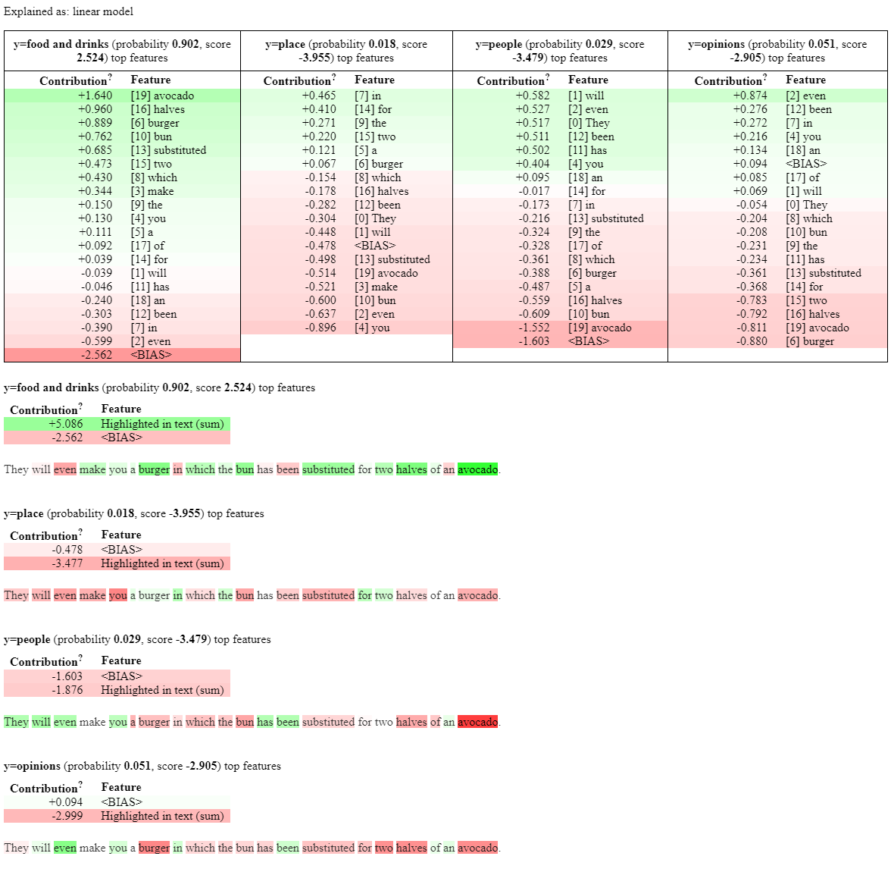

# explanations



Generating explanations for TACA's classifier trained on the restaurant reviews dataset.

## How to generate explanations

1) Install libraries in a new conda environment. On Mac:

```
conda env create -f expenv_mac.yml
```

To fix Omnixai installation:
```
brew install pkg-config
brew install mysql
export LDFLAGS="-L/usr/local/opt/openssl/lib"
export CPPFLAGS="-I/usr/local/opt/openssl/include"
python -m spacy download en_core_web_sm
```
Then follow [this guide](https://github.com/tongshuangwu/polyjuice/issues/12#issuecomment-1665358584).

On Windows:

```
conda env create -f expenv_win.yml
```

2) Activate conda environment:

```
conda activate expenv
```

Run LIME (results stored in lime.txt and lime.html files in results/lime/):

```
python run_lime.py
```

Run SHAP (results stored in shap.html and shap.png in results/shap/):
```
python run_shap.py
```

Run Anchors (results stored in anchors.txt in results/anchors/):
```
python run_anchors.py
```

Run Counterfactuals (results stored in counter.txt in results/counter/):
```
python run_counter.py
```