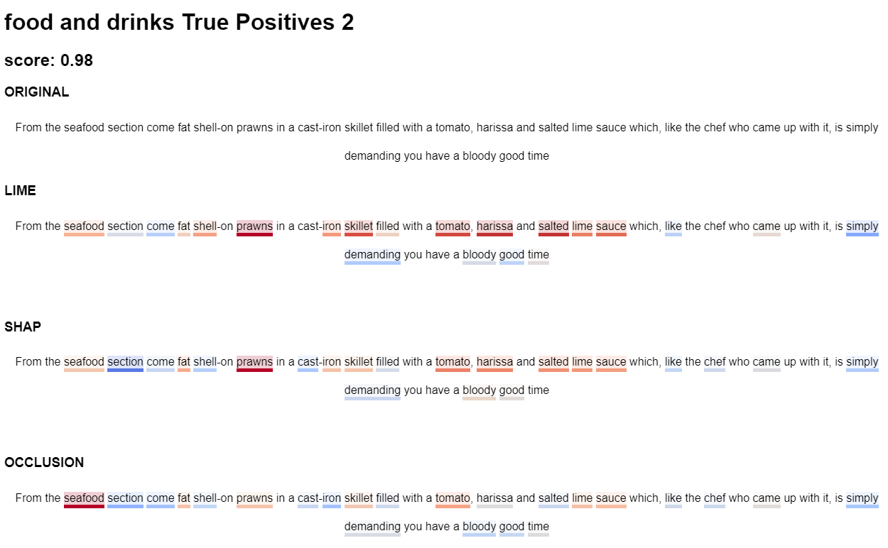

# explanations



LIME, SHAP and Occlusion heat maps for XGBoost text classification.

## Setup

Install libraries in a new conda environment. 

### On Mac:

```
conda env create -f envs/expenv_mac.yml
```

Install required homebrew packages:
```
brew install pkg-config
brew install mysql
export LDFLAGS="-L/usr/local/opt/openssl/lib"
export CPPFLAGS="-I/usr/local/opt/openssl/include"
```

### On Windows:
Follow [this guide](https://stackoverflow.com/questions/73969269/error-could-not-build-wheels-for-hnswlib-which-is-required-to-install-pyprojec)

Then:

```
conda env create -f envs/expenv_win.yml
```
### Fix OmniXAI installation:
Follow [this guide](https://github.com/tongshuangwu/polyjuice/issues/12#issuecomment-1665358584) (envs/expenv/Lib/site-packages/polyjuice/generations/generator_helpers.py).

### Activate conda environment:

```
conda activate expenv
```

### Download spaCy models:
```
python -m spacy download en_core_web_sm
python -m spacy download en_core_web_md
```

## Generate explanations

1. Train the classifier (saved in model/xgb_model.json):
```
python train.py
```
2. Classify test and train data for sampling (resuls saved in results/test/ and results/train/):
```
python classify.py
```

3. Sample sentences from all classes (saved in results/samples.csv):
```
python sample.py
```
or sample sentences from selected classes only:
```
python sample.py --class-names "food and drinks" "opinions"
```

4. Generate JSON (saved in output/json/output.json):

```
python generate_json.py
```

5. Generate HTML from JSON (saved in output/html/):
```
python generate_html.py
```
